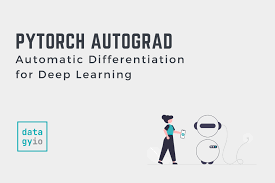

# MiniAutoGrad

A minimal automatic differentiation engine inspired by Andrej Karpathy’s micrograd, built from scratch to understand how backpropagation works under the hood.

## Overview

miniAutoGrad is a lightweight Python library that implements:

Scalar-based computation graph
Automatic differentiation (backpropagation)
Basic operations like:
Addition (+)
Multiplication (\*)
ReLU activation

This project helps you deeply understand:

How gradients flow
How neural networks learn
What PyTorch/TensorFlow do internally

## Chain Rule

${{\displaystyle {\frac {dz}{dx}}={\frac {dz}{dy}}\cdot {\frac {dy}{dx}}}}$

## Backpropagation Algorithm

Step 1: Build Graph

Track dependencies using `_prev`

Step 2: Topological Sort

```
def build_topo(v):
    ...
```

Ensures correct backward order

Step 3: Reverse Traversal

````for node in reversed(topo):
    node._backward()```
````

## Run Example:

## Step1: Clone the github into your folder:

```
https://github.com/TLNAditya/MiniAutoGrad.git
```

## step2:

create a file with .py extension

### Step3:

```
from AutoGradEngine import Value

# Create inputs
a = Value(2.0)
b = Value(3.0)

# Build computation
c = a * b
d = c + a
e = d.relu()

# Backward pass
e.backward()

# Print results
print(a, b, c, d, e)
```

## Why This Project Matters

Most people use PyTorch, but few understand:

How gradients are actually computed
How computation graphs work
Why backpropagation works

This project gives you that deep intuition.

## Inspiration

Andrej Karpathy – micrograd
Backpropagation & computational graphs
🤝 Contributing

## Feel free to:

Improve operations
Add visualization
Optimize graph traversal
